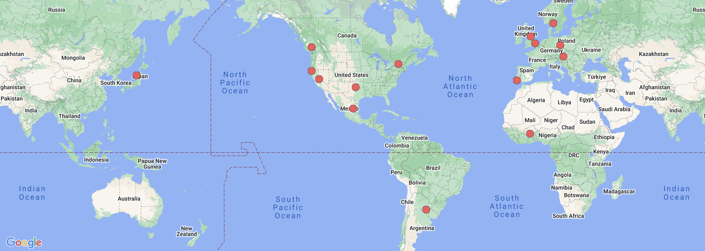

# Remix Meetup Guides

This repository is a collection of guides for running a Remix meetup.

Remix meetups are community-run groups [all around the globe](https://www.meetup.com/pro/remix-run/) where people can learn, share, and collaborate on Remix projects.

**Start here** 👉 [Starting a New Remix Meetup](./starting-a-new-meetup.md)

**Tips and tricks** 👉 [Running a Successful Meetup](./running-a-successful-meetup.md) and [Tech Tips](./tech-tips.md)

All meetups and especially meetup organizers must abide by the Remix [code of conduct](https://github.com/remix-run/remix/blob/main/CODE_OF_CONDUCT.md). Feel free to copy and use this CoC for your own meetup.
