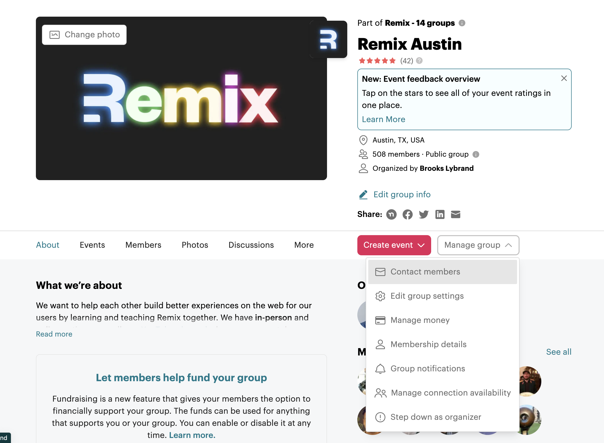

# Running a Successful Meetup

Wanting to start a new meetup? Be sure to read [Starting a New Remix Meetup](./starting-a-new-meetup.md) first and then come back to this guide.

As a Remix Meetup organizer, you're empowered and responsible to run your meetup as you see fit. Cater your meetup to your attendees, city, and culture.

There's no "Remix Meetup" formula you have to follow. Many successful meetups incorporate these 4 elements elements:

- A consistent location
- A consistent schedule (e.g. first Wednesday of the month)
- A speaker/central activity
- Food/drinks

There are meetups that also have their own websites, run hackathons, and cross-organize with other meetups. This guide is a starting point for those new to organizing a meetup. This guide is also a place for other meetup organizers to share any tips and tricks they've learned.

If you feel like something is missing, please open up a PR and contribute.

## Scheduling your first event

It's up to you when and how you want to launch your meetup. For many organizers they go through the [Starting a New Remix Meetup](./starting-a-new-meetup.md) guide and the immediately set a date and create their first event, then figure out the rest from there.

This can work, but it can also lead to softer launch than you may desire, and even potentially early [burnout](#im-getting-burned-out-what-do-i-do). Remix Tokyo organizer, [Coji Mizoguchi](https://twitter.com/techtalkjp) has a suggested formula to help kick your group off on a solid footing:

1. Reach out directly to 1-2 well-known regional folks to secure them as featured guests/speakers
2. Tentatively set the date and location based on the featured guests' availability
3. Reach out to a few other notable people letting them know the featured guests are participating
4. Once you have ~5 speaker commitments, officially announce the meetup and open registration

This approach helps ensure strong attendance and value for participants.

## How do I get people to come?

For most meetups, getting people to come is about 2 things:

1. Marketing
2. Consistency

Marketing gets people in the door. Providing a good and consistent experience is what gets people to come back. This section focuses specifically on marketing and the various channels organizers have found successful.

### Meetup.com

[Meetup.com](https://www.meetup.com/) is not perfect, but one thing it's good about is giving your meetup/events reach. This is the first layer of marketing, and you'll likely add more layers as you go.

Schedule your meetup at least 2 weeks in advance. Some meetups schedule the next 2-3 meetups in advance, which helps people plan for them and also signals that you are running a healthy meetup

### Twitter/X

Twitter/X can be a nice additional marketing channel, depending on your reach. Many people choose to stay off Twitter, which is very understandable. For better or worse, a large portion of the tech community is on Twitter. Additionally, if you have an online presence to your meetup that you want to grow, there are many developers on Twitter who aren't lucky enough to have a Remix Meetup near them that would love to join yours virtually.

If you do post about your Meetup on Twitter, be sure to tag [@remix_run](https://x.com/remix_run) so someone on the Remix team can retweet it.

### Email

Meetup allows you to email your members. As your Meetup grows, you may be hesitant to send an email to hundreds of people asking them to come to your Meetup. Remember, people joined your Meetup group for a reason. Even if they haven't come yet, they may still be intending to, and a quick email the Monday before your event, or sometime in the week prior, can be a really effective reminder.

Here's an [email template](./templates/meetup-email.md) to show you how simple it is. The key is to make it engaging, to-the-point, and actionable. Make it fun and inviting, but don't make it incredibly verbose, and most importantly have a call-to-action to RSVP.

### Remix Discord

Every meetup has a channel inside the [Remix Discord](https://rmx.as/discord) (if you don't, please bug Brooks Lybrand). This is your space to do what you want with. Some meetups use it to communicate and plan, others use it to ask questions, and others use it as just another marketing channel to post where there's a new event.

No matter how you want to use it, it's recommended to at least post when you've scheduled a new event.

## How do I get people to speak?

The easiest way to get speakers is to ask!

On your Meetup page you should have a speaker sign up form prominently displayed. In every meetup you can link to this form. The reason someone doesn't speak _should never_ be because they didn't know how to sign up.

Feel free to copy this [talk proposal template](./templates/talk-proposal.md) and edit it to fit your needs. Many meetup organizers use [Google Forms](https://www.google.com/forms/about/) since it's easy and free, but feel free to use whatever you'd like.

Finding regular speakers may take some time and persistence, but there are lots of people who want to give talks. Many have never given a technical talk before, especially not to a group of strangers. Do everything you can to lower the barrier of entry for people giving their first talk (lightning talks are a good way to do this).

The best time to ask for speakers is at each meetup. You already have a captive audience of people who want to be there and want to talk about Remix and web development. If someone is thinking about giving a talk, it may be much easier for them to talk to you in person about their idea, whereas they may forget about it during the week.

A good tip is to show a slide with a bunch of ideas for topics. Something like the following could be used:

- a11y in Remix (Accessibility)
- i18n in Remix (Internationalization)
- Demo a cool technology with Remix
- Lighting talks
  - Nested routing
  - Cookies
  - Styling strategies in Remix
  - Optimistic UI
  - MDX in Remix
  - Deploying Remix on X
  - Demo a cool project you’ve built!

### What if I don't have a speaker this month?

For many meetup organizers they become the default backup speaker for month's where they can't find someone. If you enjoy giving talks, and you are receiving positive feedback on your talks, this can be fine. Most meetup organizers try to limit the amount of talks they give, since the purpose of a local meetup is to build community, not an audience.

A good option for meetups where you don't have a speaker is to host a small workshop or mini hackathon. This takes a little prep work, and is best accomplished with the help of others. A simple format could be something like the following:

- **Goal**: Build a simple restaurant checkout flow in Remix
- **Requirements**: Must have a landing page, a product page, and a working checkout flow
- **What you're given**: Template with a SQLite data base and some wireframes

The key with a workshop or hackathon is to be very aware of time. It's better to ask groups to do too little than too much. It's also ideal to let groups share at the end of the night what they built and what they learned.

Another good tip if you do something like this is ask experienced engineers and members of the community to act as team leads ahead of time, so they can come in prepared.

## How do I find a host/sponsor?

Just like finding a speaker, the best thing to do is to ask!

Many organizers get their company to host and/or sponsor. For some organizers this won't work given the size or lack of an office.

When trying to find a host/sponsor look into the well known companies in your city. This could be a well known tech company like Shopify, or it could even be a local, but well known tech company with office space. See if you have any connections with engineers working at these companies, or reach out to a dev advocate or facilities managers. The worst a company can do is say no.

When trying to convince a company to host/sponsor, it's a good idea to phrase the meetup in terms of why it would benefit them. If their company uses Remix or React Router, that may be a very entry point. But even if they don't, many companies use React, or at the very least develop on the Web, so it can be a good community for their employees. Other benefits to companies is exposure for recruiting or for their services. Offer guaranteed speaking time or a slide for every host/sponsor so there is a mutual benefit to the relationship.

## I'm getting burned out, what do I do?

Running a meetup can be a lot of work, and while many find it very rewarding, there are times where it can feel pretty thankless. Just like with anything, it's easy to lose the spark and sense of fulfillment that first drew you in, and it can be especially hard to push through when it's something you're volunteering your personal time doing.

The first thing to recognize is it's okay to experience burnout. It doesn't mean anything bad about you, and it doesn't mean you're some sort of "failure" or that you're going to "let people down". Take care of yourself first and foremost.

When processing burnout, it might be good to take a month off from the meetup. Another option is to use a meetup event as a "social meetup", where you invite folks to meet for dinner or drinks. This can turn what has felt like a chore into something enjoyable again, and give you a moment to pause and reflect.

Once you've given yourself a second to breath, take a few minutes to ask yourself the following questions, or find someone you trust and who knows you well to ask you the following:

1. Do I want the meetup to continue
2. Do I want to be part of organizing this meetup going forward

If the answer is yes to 1 and 2, you likely need to either descale what the meetup involves, or ask for help. Descaling will be specific to your meetup, and a helpful exercise may be imaging what a sustainable meetup would look like. In either case, if you have been running a meetup for a while and have started developing relationships with the members, go ahead and ask some of the most trusted ones for help.

When asking for help, it's good to be specific. If someone picked up the food for you each week would that help you keep the meetup going? Then ask for that. Help doesn't have to be a big thing, and many people are more than willing to help out.

If you said yes to 1, and no to 2, then start asking members if anyone would like to take over the meetup. If you have the energy offer to mentor the new organizer(s) and maybe even share responsibilities for the next few meetups. This can help make the ask less daunting. If you are completely burned out and don't think you can oversee a transition, start asking for someone to take over the meetup ASAP.

If you said no to 1 and 2, first please ask if someone else would like to take over the meetup, as there may be members interested in it's continued existence. If there is no one, and you're ready to retire the meetup, please reach out to Brooks Lybrand so he can officially shut it down.
